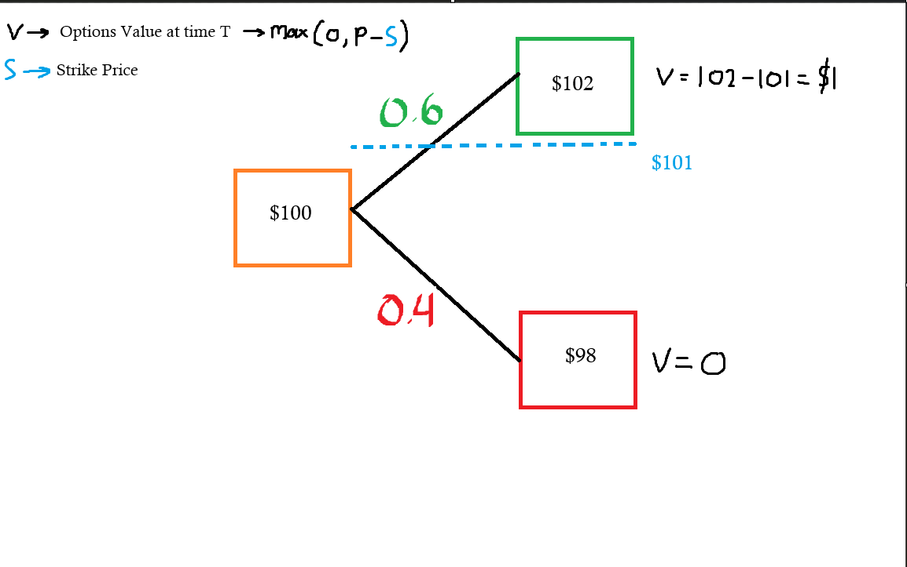

### Binomial Model Theory Overview

**Disclaimer**: Many regulatory bodies, including the European Securities and Markets Authority (ESMA) and the U.S. Federal Bureau of Investigation (FBI), have issued warnings or outright banned retail binary options trading due to widespread fraud. Most platforms are unregulated, and the business model often pits the trader against the broker, making it mathematically designed for traders to lose money. Binary options are often described as a form of gambling rather than a legitimate investment. 

**This is only for educational purposes, this is NOT financial advice**

## 5 Key Components

1. Beginning Asset Value
    --> The initial value of the underlying asset

2. Size of the **up** move
    --> The expected gain given that the underlying asset has increased in value
    --> Denotated as U

3. Size the **down** move
    --> The expected loss given that the underlying asset has decreased in value
    --> Denotated as D (= 1/U)

4. Probability of the **up** move
    --> Chances that the underlying asset increases in value
    --> Denotated as P(U)

5. Probability of the **down** move
    --> Chances that the underlying asset decreases in value
    --> Denotated as P(D) (= 1 - P(D))


## Forward Binary Tree
Say the current stock is P0 at time T0. From its current price, it can only go **up** or **down** to T + 1. Hence, we'll model this movement by adding two children nodes from the current one, with the right node having the value of P0 * U (signaling upside movement) and the left node having a value of P0 * D (downside movement). 


Then, for each of those child nodes, we'll model the price movement from that point. We'll do this until we've met the desired time, T.

#### Visual Demonstration
Here is a sample of forward binary options pricing tree with the following parameters: iterations = 2, Upside & Downside  = 10% 

        ┌── 121.00
    ┌── 110.00
    │   └── 99.00
    100.00
    │   ┌── 99.00
    └── 90.00
        └── 81.00

## Backward induction

At this point, there are many paths the stock price can take. We are given some strike price S for the option. As market makers, we want to ask ourselves, **"What is a fair price for this option"?**. 

To tackle this prompt, we start by calculating payoff: How much will this option worth at expiration (European Options).
Simply, the value of the option at price P is equal to ``` max(0, P - Strike_Price) ```. We'll use simple numbers to demonstrate in the image below.



At this point, we need to calculate the expected value of the option, which is simply V_now = e^(−rΔt) × [ P(U) × V_up + (1 − P(U)) × V_down ]
